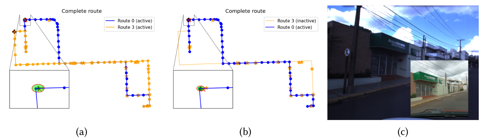
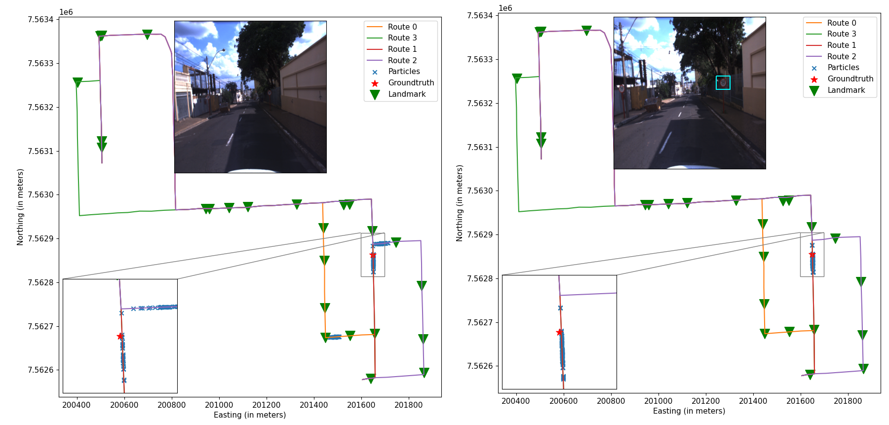

DISCLAIMER FOR THE IV2022 REVIEWERS
===========================================
Dear reviewer,

When I submitted the paper on thursday (11/March), I was hoping to update it until the deadline. However, when I was to submit the updated version in 15/Mar I was unable to do it: the system pointed that the paper was already under review process. The paper you are reviewing is severely outdated in many aspects (including the poor results) and provides the link to this repository. 

Since I was unable to update the paper in the Papercept System (I already contacted the organizers regarding my situation), I kindly ask you to read the updated version of the paper, which is available in [this repository](https://github.com/cabraile/Mapless-MCL-ROS).

I understand that this would go against the guidelines for the peer-review process, however, since I still did not hear from the organizers, I found myself without further alternatives.

Once again, thank you for understanding the situation!

**This section will be removed after the IV2022 reviewing process**

About
===========================================
This repository contains the source code and documentation of the method proposed in the papers **A Gaussian approximation of the posterior for digital map-based localization using a particle filter**, accepted at the 24th *IEEE International Conference on Intelligent Transportation Systems (ITSC 2021)*.

In this project, we propose performing global localization for autonomous vehicles using odometry information and coarse digital maps. Two types of features are used for the proposed localization method: landmarks and segment features.

Disclaimer: the Python implementation of the sign detection module was adapted from [this Ultralytics repository](https://github.com/ultralytics/yolov3) and the weights and network configuration files were used from the repository of [Martí Sánchez Juanola](https://github.com/martisaju/CARLA-Speed-Traffic-Sign-Detection-Using-Yolo).

Material
=================================================
Data were collected using the intelligent vehicle CARINA II from the *Laboratório de Robótica Móvel* (Universidade de São Paulo, campus São Carlos - Brazil).

The **collected data** (`csv` files for sensor data and `png` for image files) are available in this [link](https://drive.google.com/drive/folders/1pnjCgqEUxmjd9P2vzDNRHFrOtVp1vmHw?usp=sharing). Be aware that the data might be split into two different `zip` files. If it takes too long for the Google Drive to compress the images, there is a directory, `images_compressed`, in which the images are already compressed. The extracted images must be inside an `images` directory inside the root directory.

Instead of the raw data, if you are interested on the complete data in ROS ([Robot Operating System](https://www.ros.org/)) format, the ROS `bag` files are available [here](https://drive.google.com/drive/folders/18giw-eH9R1P60MwpYXnx0eQDewSdhfDw?usp=sharing). However, the project in this repository does not support ROS **yet**.

The **map** used for the experiments (which contains landmark positions, branches and more) are available in this [link](https://drive.google.com/drive/folders/1Y8i5SaVC1KsOmFsevDwAwse4eniqsHLp?usp=sharing).

How to run the demonstration
=====================================
**Setup**: clone this repository to your workspace and download the Python (this is a Python 3 project!) packages required for running this project. An option is to create an Anaconda environment using `conda env create --file=environment.yml`. All the packages required are enumerated in `environment.yml`. Notice that the conda environment will manage the CUDA version for this application, if a graphics card is available. Make sure the graphics drivers are installed, otherwise tensorflow will not detect the GPU.

**First step**: download the dataset and the map on the repository links described above;

**Second step**: in `scripts/config/dataset.yaml` change the value in `dataset_dir` to the directory of the dataset and `map_dir` to the root directory of the downloaded map.

**Third Step**, hit `python scripts/benchmark.py` in the root directory of the downloaded repository.

Running on different data
=====================================
If you are not interested in running this method on other datasets, there is no need to read the following lines and sections of this document.

However, if you are interested in running this method on other datasets, either for benchmarking or for proposing improvements, you will have to delve further into the modules contained in this repository.

The files contained in the `modules` folder are organized in a way that the proposed filter can be employed on different projects. They are organized in the following directories:
- `demo`: code specifically for running the benchmark.
- `features`: higher level abstraction of the features used in this project, as the segment feature and the landmark.
- `filters`: the implementations of the digital map-based localization filters (in `dml`) and the extended Kalman Filter in `ekf` which fuses the global localization provided by one of the filters in `dml` to sensor data.
- `perception`: landmark and sign detection tasks.

Short-term TODO-list
==================
* Fill description of the modules in the readme.md file;
* Complete the rest of the code's docstring
* Implement a demo for a single filter at time;

Long-term TODO-list
============================
* Integrate with OpenStreetMap API so that the map can be retrieved directly from there;
* C++ implementation
* ROS integration
